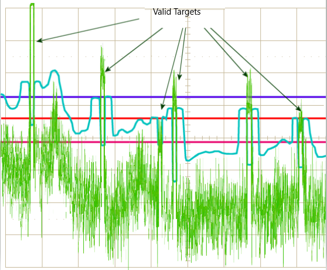

# SFND Radar Target Generation and Detection
## [Rubric](https://review.udacity.com/#!/rubrics/2548/view) Points
---
Description of radar-target-generation-and-detection.m file. The project was done during Nanodegree on Sensor Fusion.


#### 1. FMCW Waveform Design

Using the given system requirements, design a FMCW waveform. Find its Bandwidth (B), chirp time (Tchirp) and slope of the chirp.

```Matlab
%% Radar Specifications 
% Frequency of operation = 77GHz
% Max Range = 200m
% Range Resolution = 1 m
% Max Velocity = 100 m/s
R_Target = 110;    % initial distance of the target 
v_Traget = -20;    % speed of the target. The velocity varies from -70 to +70 m/s

%Operating carrier frequency of Radar 
fc= 77e9;            % carrier freq            [Hz= 1/s]

% Initial conditions of Radar
max_range = 200;     % the radar maximum range [m]
d_res = 1;           % range resolution        [m]
c = 3*10^8 ;         % ligth speed             [m/s]

% Sweep time for each chirp is defined as rule by 5.5 times of
% round trip time for Maximum Range
Tchirp = 5.5 * 2 * max_range / c;       % Tchirp

% Bandwidth for the each chirp for given resolution 
Bandwidth = c/(2*d_res);

% The slope of the chirp
Slope = Bandwidth/Tchirp;
```
#### 2. Simulation Loop

Radar determines the range of the target by measuring the trip time of the electromagnetic signal it radiates. 
It is known that EM wave travels at a known speed (300,000,000 m/s), so to determine the range the radar needs to calculate the trip time.
-   By measuring the shift in the frequency, and converting them into beat signal, in order to process in a fft.

Simulate Target movement and calculate the beat or mixed signal for every timestamp.

```Matlab
%The number of chirps in one sequence. Its ideal to have 2^ value for the ease of running the FFT
%for Doppler Estimation. 

Nd=128;                   % #of doppler cells OR #of sent periods % number of chirps
Nr=1024;                  %for length of time OR # of range cells
t=linspace(0,Nd*Tchirp,Nr*Nd); %total time for samples

%Creating the vectors for Tx, Rx and Mix based on the total samples input.
Tx  = zeros(1,length(t)); %transmitted signal
Rx  = zeros(1,length(t)); %received signal
Mix = zeros(1,length(t)); %beat signal

%Similar vectors for range_covered and time delay.
r_t = zeros(1,length(t));
td  = zeros(1,length(t));
for i=1:length(t)          
    %For each time stamp update the Range of the Target for constant velocity. 
    r_t(i) = R_Target + v_Traget*t(i);
    tau(i) = (2*r_t(i))/c;
    
    %For each time sample we need update the transmitted and
    %received signal. 
    Tx(i)  = cos(2*pi * (fc*t(i) +Slope*(t(i)^2) / 2));
    Rx(i) = cos(2*pi * (fc*(t(i)-tau(i)) + 0.5*Slope*(t(i)-tau(i))^2));
    
    %Now by mixing the Transmit and Receive generate the beat signal
    %This is done by element wise matrix multiplication of Transmit and
    %Receiver Signal
    Mix(i) = Tx(i).*Rx(i);
    
end
```

#### 3. Range FFT (1st FFT)


The FMCW waveform has the characteristic that the frequency varies linearly with time. If radar can determine the delta between the received frequency and hardware’s continuously ramping frequency then it can calculate the trip time and hence the range


Implement the Range FFT on the Beat or Mixed Signal and plot the result.

```Matlab
%% RANGE MEASUREMENT

%reshape the vector into Nr*Nd array. Nr and Nd here would also define the size of
%Range and Doppler FFT respectively.
Mix = reshape(Mix,[Nr,Nd]);

%run the FFT on the beat signal along the range bins dimension (Nr) and
%normalize.
signal_fft = fft(Mix,Nr);

% Take the absolute value of FFT output
signal_fft = abs(signal_fft)./Nr;

% Output of FFT is double sided signal, but we are interested in only one side of the spectrum.
% Hence we throw out half of the samples.
signal_fft = signal_fft(1:Nr/2+1);

```

#### 4. Doppled FFT (FFT2)


The velocity estimation for radar is based on an age old phenomenon called the doppler effect. As per doppler theory an approaching target will shift an emitted and reflected frequency higher, whereas a receding target will shift the both frequencies to be lower than the transmitted frequency. 
Calculation of velocity of target obstacles. 


By measuring the shift in the frequency due to doppler, radar can determine the velocity. The receding target will have a negative velocity due to the frequency dropping lower, whereas the approaching target will have positive velocity as the frequency shifts higher.

Implement the 2D CFAR process on the output of 2D FFT operation, i.e the Range Doppler Map.

```Matlab
% 2D FFT using the FFT size for both dimensions.
sig_fft2 = fft2(Mix,Nr,Nd);

% Taking just one side of signal from Range dimension.
sig_fft2 = sig_fft2(1:Nr/2,1:Nd);

% Shift the zero-frequency component to the center of the output
sig_fft2 = fftshift (sig_fft2);

%Generate a Range Doppler Map 
RDM = abs(sig_fft2);
RDM = 10*log10(RDM) 
```

#### 5. CFAR Implementation 


The false alarm issue can be resolved by implementing the constant false alarm rate. CFAR varies the detection threshold based on the vehicle surroundings. The CFAR technique estimates the level of interference in radar range and doppler cells “Training Cells” on either or both the side of the “Cell Under Test”. The estimate is then used to decide if the target is in the Cell Under Test (CUT).

-   Determine the number of Training cells for each dimension. Similarly, pick the number of guard cells.


```Matlab
%Select the number of Training Cells in both the dimensions.
Tr = 12;
Td = 8;

%Select the number of Guard Cells in both dimensions around the Cell under 
%test (CUT) for accurate estimation
Gr = 4 ;
Gd = 4 ;
% offset the threshold by SNR value in dB
offset = 1.2;

n_TrainCells = (2*(Td+Gd+1)*2*(Tr+Gr+1)-(Gr*Gd)-1);
```
-   Slide the cell under test across the complete matrix. Make sure the CUT has margin for Training and Guard cells from the edges.

```Matlab

for i = Tr + (Gr+1) : Nr/2 - (Gr+Tr)
    for j = Td + (Gd+1) : Nd- (Gd+Td)
        % Grid Size: (2Tr + 2Gr + 1) * (2Td+ 2Gd +1)
        for p = i - (Tr+Gr) : i + (Tr+Gr)
            for q = j - (Td+Gd) : j - (Td+Gd)
                if (abs(i-p)>Gr || abs (j-q)>Gd)
                ...
```
-   For every iteration sum the signal level within all the training cells. 

```Matlab
noise_level = noise_level + db2pow(RDM(p,q)); % db2pow convert log to linear
```
-   Average the summed values for all of the training cells used. After averaging convert it back to logarithmic using pow2db.
```Matlab
threshold = pow2db(noise_level/n_TrainCells)
```
-   Further add the (SNR) offset to it to determine the threshold. 
```Matlab
threshold = threshold + offset;
```
-   Next, compare the signal under CUT against this threshold.
    If the CUT level > threshold assign it a value of 1, else equate it to 0.
```Matlab
if(RDM(i,j)<threshold)
    RDM(i,j) = 0;
else
    RDM(i,j) = 1;
end
```


### An addition, there are multiple categories of CFAR:

-   Cell Averaging CFAR (CA-CFAR)
-   Ordered Statistics CFAR (OS CFAR)
-   Maximum Minimum Statistic (MAMIS CFAR)
-   And, multiple variants of CA-CFAR.


